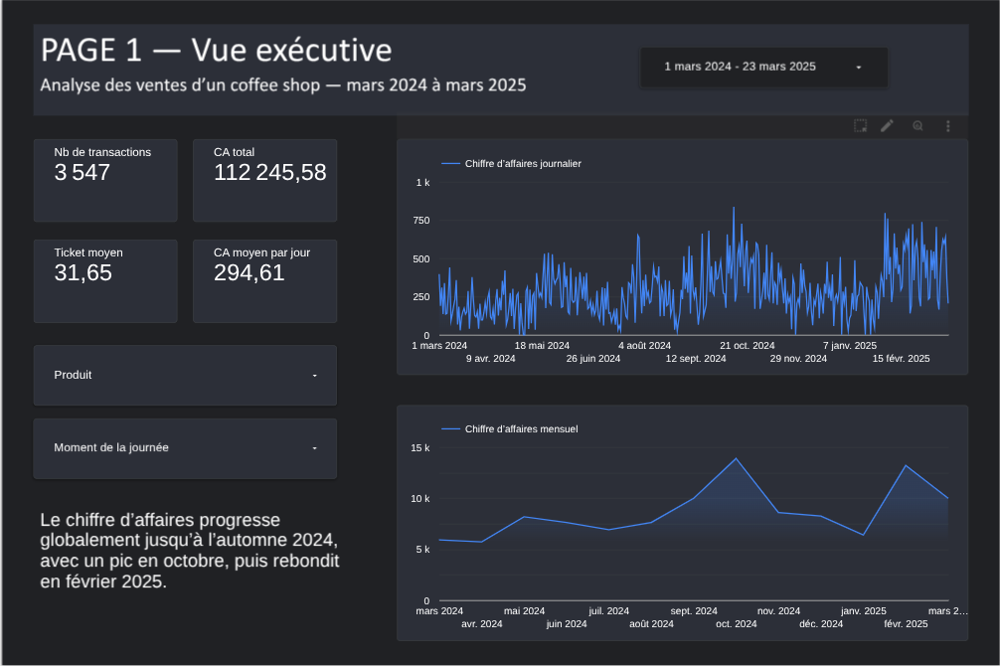
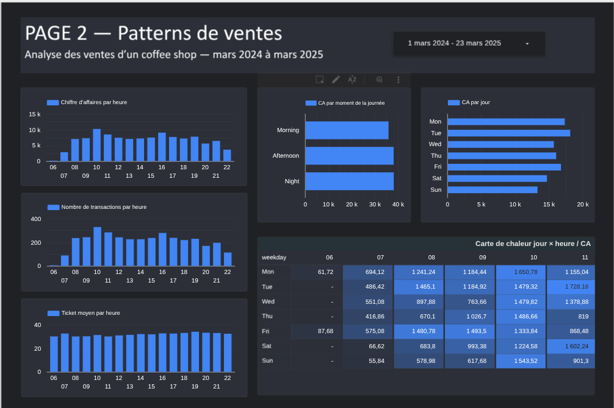
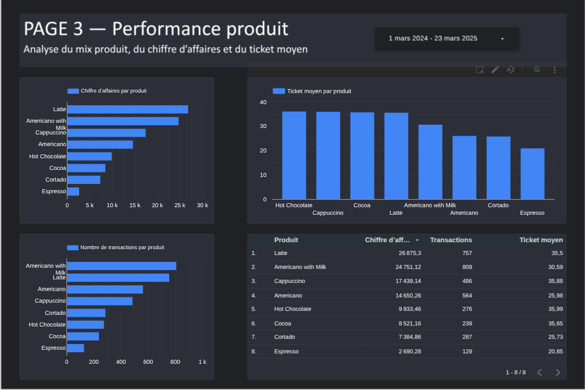
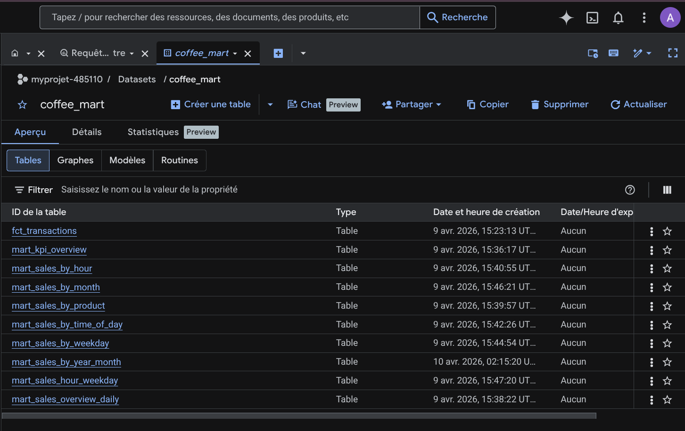
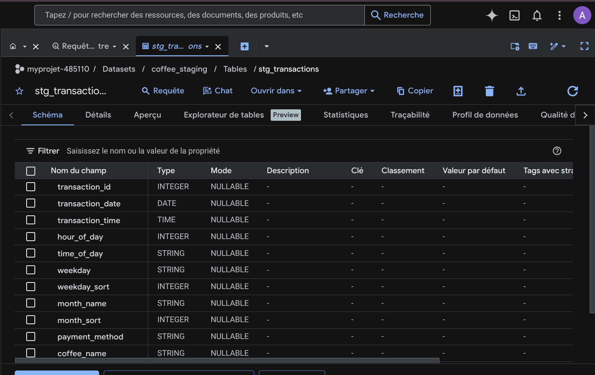
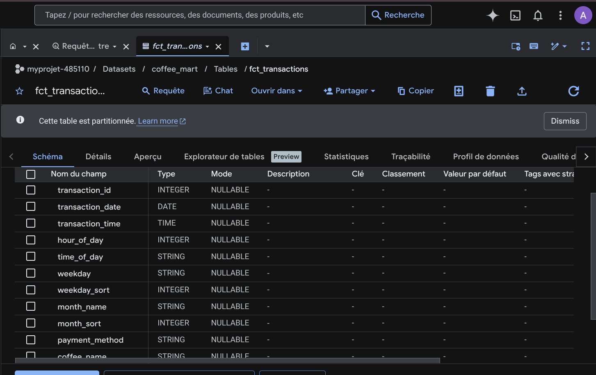

# Analyse des ventes d’un coffee shop avec BigQuery et Looker Studio

Projet de **Sales Analytics / Business Intelligence** réalisé avec **BigQuery**, **SQL** et **Looker Studio** à partir de données transactionnelles d’un coffee shop.

L’objectif du projet est de transformer un dataset brut en un système d’analyse orienté décision permettant d’identifier :
- les principaux drivers du chiffre d’affaires,
- les produits les plus contributifs,
- les créneaux horaires les plus performants,
- et les leviers opérationnels les plus pertinents pour améliorer la performance commerciale.

---

## Vue d’ensemble

Ce projet porte sur l’analyse des ventes d’un coffee shop entre **mars 2024 et mars 2025**.

À partir d’un dataset transactionnel, j’ai construit un pipeline analytique structuré dans **BigQuery**, puis un dashboard **Looker Studio** orienté décision, afin de répondre à une question business simple :

> Quels sont les principaux drivers du chiffre d’affaires du coffee shop, et quels leviers d’action peuvent être activés pour améliorer la performance commerciale ?

Le projet a été structuré en plusieurs étapes :
- import de la donnée brute dans BigQuery,
- contrôle qualité et standardisation,
- modélisation analytique en couches `raw`, `staging` et `mart`,
- création de tables de reporting,
- construction d’un dashboard interactif dans Looker Studio,
- synthèse business finale.

---

## Résultat en 30 secondes

J’ai construit une analyse Sales Analytics d’un coffee shop avec BigQuery et Looker Studio.

- Données : 3 547 transactions, mars 2024 à mars 2025
- Objectif : identifier les drivers du chiffre d’affaires
- Stack : BigQuery SQL, Looker Studio, GitHub
- Résultats clés :
  - CA total : 112 245,58
  - Ticket moyen : 31,65
  - Pic de CA : 10h
  - Produits moteurs : Latte, Americano with Milk, Cappuccino
- Recommandations :
  - renforcer le staffing sur les pics horaires
  - mettre en avant les produits à forte contribution
  - stimuler les périodes faibles, notamment le week-end

---

## Résumé exécutif

L’analyse met en évidence plusieurs enseignements clés :

- Le chiffre d’affaires est concentré sur un petit nombre de références : **Latte**, **Americano with Milk** et **Cappuccino** sont les principaux moteurs de revenu.
- Le mix produit ne raconte pas seulement une logique de volume : **Latte** est n°1 en chiffre d’affaires, tandis que **Americano with Milk** est n°1 en nombre de transactions.
- La performance varie fortement selon le temps : **10h** est l’heure la plus contributive en chiffre d’affaires, avec un second bloc fort visible en fin d’après-midi.
- Les jours de semaine performent mieux que le week-end, et l’écart de chiffre d’affaires semble surtout expliqué par le **volume de transactions**, plus que par une forte variation du ticket moyen.
- Le dashboard final permet d’identifier rapidement les produits les plus contributifs, les créneaux à staffer en priorité et les périodes plus faibles à stimuler commercialement.

---

## Contexte business

Le management d’un coffee shop dispose de données transactionnelles, mais n’a pas forcément une vision claire de :
- ce qui génère réellement le chiffre d’affaires,
- quels produits contribuent le plus à la performance,
- quels moments de la journée ou de la semaine concentrent l’activité,
- où concentrer les efforts opérationnels et commerciaux.

Ce projet vise donc à transformer des données transactionnelles brutes en **insights actionnables**.

---

## Question business

> Quels sont les principaux drivers du chiffre d’affaires du coffee shop, et quelles actions concrètes peuvent être mises en place pour améliorer la performance commerciale ?

---

## Décision business à éclairer

Cette analyse vise à aider à prioriser les décisions suivantes :
- quels produits mettre davantage en avant,
- quels créneaux nécessitent le plus d’attention opérationnelle,
- quels moments plus faibles pourraient être stimulés par des actions commerciales ciblées,
- comment mieux ajuster le staffing et l’animation commerciale dans la journée.

---

## Dataset

Le dataset contient des transactions de vente avec notamment :
- la date de transaction,
- l’heure de transaction,
- le nom du produit,
- le montant de la transaction,
- le moment de la journée,
- le jour de semaine,
- le mois.

### Grain analytique
Le grain principal d’analyse est la **transaction de vente**.

### Population analysée
L’analyse porte sur **3 547 transactions**.

### Période étudiée
**Mars 2024 à mars 2025**.

### Limites du dataset
- absence de `customer_id` : pas d’analyse de fidélité ou de réachat client,
- absence de coût ou de marge : l’analyse porte sur le chiffre d’affaires, pas sur la profitabilité,
- un seul mode de paiement observé (`card`) : pas de comparaison pertinente des comportements de paiement,
- les comparaisons mensuelles doivent être interprétées avec prudence sur **mars 2024** et **mars 2025**, qui sont des mois partiels.

---

## Stack utilisée

- **BigQuery**
- **SQL**
- **Looker Studio**

---

## Architecture analytique

Le projet a été structuré en trois couches :

### `coffee_raw.transactions_raw`
Table brute importée dans BigQuery.

### `coffee_staging.stg_transactions`
Table nettoyée et standardisée :
- cast des types,
- renommage des colonnes,
- création d’un `transaction_id`,
- création de variables analytiques comme `is_weekend`.

### `coffee_mart.fct_transactions`
Table de faits centrale au grain transaction.

### Tables de reporting
Création de marts dédiés pour :
- la vue journalière,
- la vue mensuelle,
- l’analyse produit,
- l’analyse par heure,
- l’analyse par moment de journée,
- l’analyse par jour de semaine,
- la vue croisée jour × heure.

---

## Sources de données du dashboard

### Source principale
`myprojet-485110.coffee_mart.fct_transactions`

Utilisée pour :
- KPI de la page 1,
- chiffre d’affaires journalier,
- chiffre d’affaires par heure,
- nombre de transactions par heure,
- ticket moyen par heure.

### Source complémentaire 1
`myprojet-485110.coffee_mart.mart_sales_by_year_month`

Utilisée pour :
- chiffre d’affaires mensuel,
- tendance chronologique mensuelle.

### Source complémentaire 2
`myprojet-485110.coffee_mart.mart_sales_by_weekday`

Utilisée pour :
- chiffre d’affaires par jour de semaine,
- ordre correct **Mon → Sun**.

### Source complémentaire 3
`myprojet-485110.coffee_mart.mart_sales_by_time_of_day_sorted`

Utilisée pour :
- chiffre d’affaires par moment de la journée,
- ordre correct **Morning → Afternoon → Night**.

### Source complémentaire 4
`myprojet-485110.coffee_mart.mart_sales_hour_weekday`

Utilisée pour :
- carte de chaleur **jour × heure**.

### Source complémentaire 5
`myprojet-485110.coffee_mart.mart_sales_by_product`

Utilisée pour :
- chiffre d’affaires par produit,
- nombre de transactions par produit,
- ticket moyen par produit,
- tableau récapitulatif produit.

---

## KPI principaux

- Nombre de transactions
- Chiffre d’affaires total
- Ticket moyen
- Chiffre d’affaires moyen par jour
- Chiffre d’affaires par produit
- Nombre de transactions par produit
- Ticket moyen par produit
- Chiffre d’affaires par heure
- Nombre de transactions par heure
- Chiffre d’affaires par jour de semaine

---

## Démarche analytique

### 1. Import et audit de la donnée brute
- import du dataset CSV dans BigQuery,
- vérification du volume,
- contrôle des dimensions temporelles,
- contrôle des valeurs nulles et incohérentes.

### 2. Création de la couche staging
- typage des colonnes,
- standardisation des noms,
- création d’un identifiant technique,
- ajout d’une variable `is_weekend`.

### 3. Construction de la table de faits
- création d’une `fct_transactions` au grain transaction,
- partitionnement par date,
- structuration pour l’analyse et le reporting.

### 4. Construction des marts
- tables dédiées aux KPI,
- agrégations par produit, heure, moment de journée, jour de semaine et mois,
- création d’une table croisée jour × heure pour la carte de chaleur.

### 5. Création du dashboard
- structuration du dashboard en 3 pages,
- hiérarchisation des KPI et des visualisations,
- mise en forme orientée lecture business.

---

## Insights clés

### 1. Le chiffre d’affaires est concentré sur peu de produits
Le revenu repose principalement sur quelques références, avec **Latte**, **Americano with Milk** et **Cappuccino** comme principaux contributeurs.

### 2. Volume et valeur ne racontent pas la même histoire
**Americano with Milk** domine en volume, mais **Latte** domine en chiffre d’affaires, ce qui montre que certains produits performent davantage par la valeur unitaire.

### 3. Le pic de chiffre d’affaires est autour de 10h
L’activité commerciale culmine en fin de matinée, avec un second bloc fort visible en fin d’après-midi.

### 4. Le ticket moyen augmente plutôt en soirée
Certaines heures performent moins en volume mais davantage en valeur moyenne, ce qui nuance une lecture purement fréquentationnelle.

### 5. Les jours de semaine performent mieux que le week-end
Le coffee shop réalise davantage de chiffre d’affaires en semaine, et cette différence semble surtout liée au volume de transactions plutôt qu’à une forte hausse du ticket moyen.

### 6. La tendance mensuelle progresse globalement jusqu’à l’automne 2024
Le chiffre d’affaires augmente globalement jusqu’à l’automne 2024, avec un pic en octobre, puis rebondit en février 2025.

---

## Recommandations business

### 1. Prioriser le staffing sur les créneaux les plus contributifs
Renforcer prioritairement la disponibilité opérationnelle sur les créneaux les plus performants, notamment autour de **10h** et en fin d’après-midi.

### 2. Mettre davantage en avant les produits les plus contributifs
Accentuer la visibilité de **Latte** et **Cappuccino**, qui contribuent fortement au chiffre d’affaires.

### 3. Utiliser Americano with Milk comme produit d’appel
Sa forte contribution en volume en fait un bon candidat pour des logiques de mise en avant.

### 4. Stimuler les périodes les plus faibles
Tester une offre ciblée sur les créneaux faibles, avec comparaison avant/après sur transactions et CA.

### 5. Réévaluer le rôle d’Espresso dans le mix produit
Espresso contribue faiblement au chiffre d’affaires global ; Vérifier avec des données de marge avant décision, car le CA seul ne suffit pas à juger sa rentabilité.

---

## Dashboard

Le dashboard Looker Studio est structuré en 3 pages.

### Page 1 — Vue exécutive
- KPI principaux
- chiffre d’affaires journalier
- chiffre d’affaires mensuel
- lecture synthétique de la tendance

### Page 2 — Patterns de ventes
- chiffre d’affaires par heure
- transactions par heure
- ticket moyen par heure
- chiffre d’affaires par moment de la journée
- chiffre d’affaires par jour de semaine
- carte de chaleur jour × heure

### Page 3 — Performance produit
- chiffre d’affaires par produit
- transactions par produit
- ticket moyen par produit
- tableau de synthèse produit

---

## Captures BigQuery

### Structure des datasets

### Aperçu de la table staging

### Aperçu de la fact table

---

## Structure du repo

- `captures/` : captures du dashboard et de l’environnement BigQuery
- `dashboard/` : lien ou export du dashboard Looker Studio
- `donnees/` : description du dataset source
- `sql/` : scripts SQL de transformation et de validation

---

## Livrables

- dashboard Looker Studio en 3 pages
- scripts SQL de transformation dans BigQuery
- tables analytiques `raw`, `staging` et `mart`
- captures du dashboard
- synthèse business et recommandations opérationnelles

---

## Compétences démontrées

Ce projet me permet de montrer :
- l’import et la structuration de données dans BigQuery,
- la modélisation analytique en couches `raw / staging / mart`,
- l’écriture de requêtes SQL orientées KPI,
- la construction d’un dashboard Looker Studio lisible et orienté décision,
- la capacité à transformer une analyse descriptive en recommandations business concrètes.

---

## Lien du dashboard

Voir le dashboard complet ici :

[**[Dashboard]**](https://datastudio.google.com/s/rmz0Y10Z4bM)

---

## Suite logique du projet

Une évolution naturelle de ce projet serait d’ajouter :
- des données de marge ou de coût pour passer du chiffre d’affaires à la profitabilité,
- des données clients pour analyser la fidélité,
- des données promotionnelles pour mesurer l’impact commercial des actions marketing.
